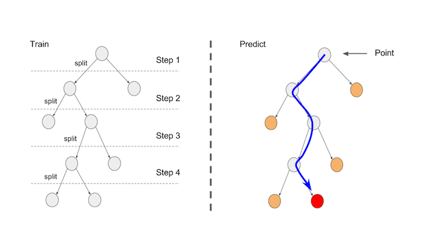

# Introducing Bisecting K-means Clustering in MLlib 1.6

With the release of Apache Spark 1.6, we now support a distributed bisecting k-means clustering algorithm [[SPARK-6517](https://issues.apache.org/jira/browse/SPARK-6517)].  A bisecting k-means algorithm is an efficient variant of k-means in the form of a hierarchy clustering algorithm (one of the most common form of clustering algorithms).  This bisecting k-means algorithm is based on the paper ["A comparison of document clustering techniques"](http://www.cs.cmu.edu/~dunja/KDDpapers/Steinbach_IR.pdf) by Steinbach, Karypis, and Kumar, with modification to be optimized for Apache Spark.


## Bisecting K-means

In general, there are two strategies for hierarchical clustering.

- **Agglomerative**: This is a "bottom up" approach where each observation starts in its own cluster, and pairs of clusters are merged as one moves up the hierarchy.
- **Divisive**: This is a "top down" approach where all observations start in one cluster, and splits are performed recursively as one moves down the hierarchy.

To take advantages of shared-nothing clustering within Apache Spark, our implementation of the bisecting k-means algorithm takes on a divisive hierarchy clustering approach.  


In training, the algorithm starts from a single cluster that contains all points. Iteratively, it finds divisible clusters on the bottom level, and then bisects each of them using k-means until there are *k* leaf clusters in total or no leaf clusters are divisible. The bisecting steps of clusters on the same level are grouped together to increase parallelism. In the case where bisecting all divisible clusters on the bottom level would result more than *k* leaf clusters, the larger clusters would be prioritized.

When using the trained model for prediction, the algorithm starts by comparing the point with the child cluster centers of the root cluster node. Then the point is compared with the child cluster centers of the closest child of the root. The prediction process continues to iterate until it reaches a leaf cluster node. Finally, the point is assigned to the closest leaf cluster node.


## A Code Example

The bisecting k-means in MLlib currently has the following parameters.

* *k*: The desired number of leaf clusters (default: 4). The actual number could be smaller when there are no divisible leaf clusters.
* *maxIterations*: The maximum number of k-means iterations to split clusters (default: 20).
* *minDivisibleClusterSize*: The minimum number of points (if >= 1.0) or the minimum proportion of points (if < 1.0) of a divisible cluster (default: 1)
* *seed*: A random seed (default: hash value of the class name).

In general, the common hierarchical clustering does not require prespecifying the number of clusters, and are deterministic. Since holding a hierarchy of massive data points is hard, we add a parameter to specifying the number of of the cluster. The result of the clustering, a dendrogram should have all points as leaf nodes. Because of the same reason, we provide *minDivisibleClusterSize* for a parameter to define a condition to stop splitting.

```
import org.apache.spark.mllib.clustering.BisectingKMeans
import org.apache.spark.mllib.linalg.{Vector, Vectors}

// Loads and parses data
def parse(line: String): Vector = Vectors.dense(line.split(" ").map(_.toDouble))
val data = sc.textFile("data/mllib/kmeans_data.txt").map(parse).cache()

// Clustering the data into 6 clusters by BisectingKMeans.
val bkm = new BisectingKMeans().setK(6)
val model = bkm.run(data)

// Show the compute cost and the cluster centers
println(s"Compute Cost: ${model.computeCost(data)}")
model.clusterCenters.zipWithIndex.foreach { case (center, idx) =>
  println(s"Cluster Center ${idx}: ${center}")
}
```


## What's Next?

We currently have implemented the fundamental methods: train and predict.  Future proposed work includes the following jiras:

* **[[SPARK-11664](https://issues.apache.org/jira/browse/SPARK-11664)] Add methods to get bisecting k-means cluster structure:** To extract the result dendrogram() to visualize the denogram to confirm the reuslts.
* **[[SPARK-8459](https://issues.apache.org/jira/browse/SPARK-8459)] Add import/export to spark.mllib bisecting k-means** 
* **[[SPARK-11665](https://issues.apache.org/jira/browse/SPARK-11665)] Support other distance metrics for bisecting k-means:** Working to support various distance metrics (cosine distance, Tanimoto distance) to calculate a distance between a cluster center and each input point as we currently only support Euclidean distance.


## Acknowledgement

The bisecting k-means in MLlib has been developed as a collaboration between Spark contributors.

Xiangrui Meng and Yu Ishikawa made the inital implementation.  Jeremy Freeman, RJ Nowling and others have contributed to this work.

## Addendum
Some additional resources to learn more about Bisecting K-Means Clustering in Spark MLlib:

* [A Comparison of Document Clustering Techniques](http://cs.fit.edu/~pkc/classes/ml-internet/papers/steinbach00tr.pdf) by Steinbach, Karypis, and Kumar
* [Data Mining Clustering](http://wwwis.win.tue.nl/~tcalders/teaching/datamining09/slides/DM09-07-Clustering.pdf): A solid overview slide deck explaining clustering algorithms including partitioning and hierarchical clustering.
* [Introduction to Information Retrieval: Hierarchical Clustering (Chapter 17)](http://nlp.stanford.edu/IR-book/pdf/17hier.pdf)
* [Bisecting K-Means Class](https://spark.apache.org/docs/1.6.0/api/java/org/apache/spark/mllib/clustering/BisectingKMeans.html) (Apache Spark Documentation)
* [MLlib Clustering ](http://spark.apache.org/docs/latest/mllib-clustering.html#bisecting-k-means) (Apache Spark documentation)

